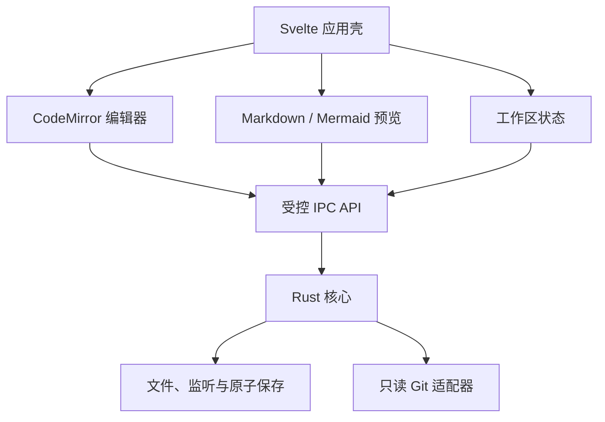
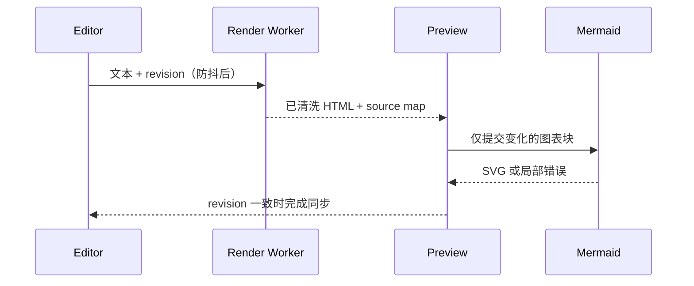
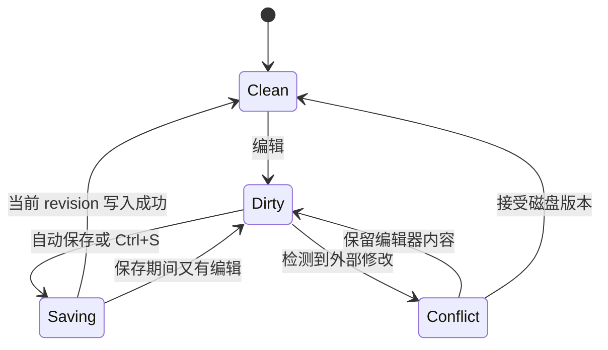

# MarkdownEditor 设计方案 v1.0

> 状态：方案已确认，v0.1.0 已进入开发  
> 日期：2026-08-24  
> 目标：构建一款面向本地项目与 Git 工作区的轻量级桌面 Markdown 编辑器。

## 1. 结论摘要

推荐采用以下技术路线：

| 层次 | 选型 | 主要原因 |
| --- | --- | --- |
| 桌面壳与系统能力 | Tauri 2 + Rust | 使用操作系统 WebView，不随应用捆绑完整浏览器内核；便于控制文件权限、进程调用和原子保存 |
| 前端 UI | Svelte + TypeScript + Vite | 编译型组件模型，适合中等复杂度桌面 UI；避免引入重量级 UI 框架 |
| 文本编辑器 | CodeMirror 6 | 模块化、可按需装配，支持 Markdown、只读模式和 Merge/Diff View |
| Markdown 渲染 | markdown-it | CommonMark 兼容、扩展机制清晰、速度快，适合按需增加任务列表、脚注、标题锚点等能力 |
| 图表 | Mermaid，按需动态加载 | 只在文档包含 Mermaid 代码块时加载；对图表进行缓存和隔离渲染 |
| HTML 安全 | DOMPurify + CSP + Markdown 原生 HTML 默认关闭 | 防止预览内容获得应用级文件或脚本能力 |
| Git 读取 | 本机 Git CLI 的只读适配器 | 安装包更小；对 worktree、重命名、属性配置和现有仓库行为兼容最好 |
| 本地配置 | Rust 侧 JSON 配置；必要时再升级 SQLite | v1 数据量小，不必过早引入数据库 |
| 打包 | Tauri CLI + PowerShell/Shell 脚本 + GitHub Actions | Windows 首发版只生成 Release EXE 便携 ZIP，并保留一键脚本与自动发布 |

Tauri 官方说明其桌面应用由 Rust 与系统 WebView 组合构成，并强调可生成小型、快速的二进制；CodeMirror 官方提供编辑器状态、语言支持及 Merge View；markdown-it 官方定位为快速、可扩展且默认安全的 CommonMark 解析器。参见[Tauri 架构](https://v2.tauri.app/concept/architecture/)、[Tauri 简介](https://v2.tauri.app/start/)、[CodeMirror 参考手册](https://codemirror.net/docs/ref/)和[markdown-it 项目说明](https://github.com/markdown-it/markdown-it)。

本方案的关键约束是：**Markdown 文件可编辑；其他文件只能查看；Git 功能只读；预览内容永远不直接获得系统权限。**

## 2. 产品边界

### 2.1 v1 必须实现

1. 注册、切换、移除多个工作区。
2. 每个工作区对应一个本地目录；支持注册和切换多个工作区，但不提供添加目录根或多窗口能力。
3. Markdown 文件具备编辑、预览、源码/渲染分屏三种模式。
4. Markdown 支持自动保存、手工保存、未保存状态和外部修改冲突处理。
5. 非 Markdown 文件只能以只读方式查看。
6. 预览支持常用 Markdown、相对链接、文内锚点、本地图片及 Mermaid 图表。
7. 能读取当前文件的 Git 状态、提交历史、历史版本和差异。
8. 提供本地一键打包脚本和 CI 自动打包流程，脚本随源码长期保留。

### 2.2 v1 明确不做

- 所见即所得编辑。
- Git add、commit、checkout、revert、merge 等写操作。
- 云同步、多人协作和账号体系。
- VS Code 式插件市场。
- Word、Excel 等专有格式的内置解析。
- 内置终端、AI Agent 或命令执行器。
- 同一文件的多人并发编辑。

这些能力会显著增加体积、安全面和维护成本，且不是当前 Markdown 编辑器的核心竞争力。

## 3. 核心概念

为避免 `project`、`workspace`、`folder` 混用，统一定义：

| 概念 | 定义 |
| --- | --- |
| Folder Root | 一个被授权访问的本地目录，可以是普通目录、Git 仓库或 Git worktree |
| Workspace | 一个已保存的工作环境，包含一个 Folder Root 以及 UI 状态 |
| Document Session | 一个已打开文件的会话，包含内容版本、脏状态、视图模式和滚动位置 |

Workspace 元数据保存在应用数据目录，不默认向用户仓库写入 `.markdowneditor` 等文件。这样不会污染 Git 状态。后续可增加可选的、便于分享的 `*.mdworkspace` 工作区描述文件。

建议的数据模型：

```text
Workspace
  id
  name
  roots[]: { canonicalPath, displayName } # 新工作区固定单元素；数组仅用于兼容旧配置
  activeDocument
  openedDocuments[]
  expandedDirectories[]
  preferredViewMode
  updatedAt

DocumentSession
  canonicalPath
  kind: markdown | text | image | pdf | unsupported
  editable
  contentRevision
  savedRevision
  diskFingerprint
  encoding
  lineEnding
  viewMode
```

其中 `diskFingerprint` 至少包含修改时间、文件大小和内容哈希，用于识别外部修改。

## 4. 总体架构



### 4.1 进程职责

前端只负责：

- UI、编辑器交互和文档会话状态。
- Markdown 解析调度、预览更新和滚动同步。
- 展示 Git 历史和 Diff 结果。

Rust 核心只负责：

- 工作区授权边界和路径校验。
- 目录枚举、文件读取、文件监听与原子写入。
- 非 UTF-8、超大文件和符号链接处理。
- 调用只读 Git 命令并将结果转换为结构化数据。
- 保存应用配置和崩溃恢复快照。

所有前端到系统的操作都必须经过窄接口，不给 WebView 开放任意文件系统或任意命令执行权限。Tauri 的能力模型允许按窗口和功能限定权限，适合作为这里的第二层防线；参见[Tauri Capabilities](https://v2.tauri.app/security/capabilities/)。

## 5. 多工作区设计

### 5.1 用户体验

主界面左上方提供工作区切换器，支持：

- 打开文件夹为新工作区。
- 最近工作区列表。
- 在主窗口内切换工作区。
- 从列表移除工作区，但绝不删除磁盘目录。
- 工作区路径失效时重新定位。

应用只保留一个主窗口。大量工作区不会同时扫描，只有当前选中的工作区才启动目录读取和文件监听。

### 5.2 文件树性能策略

- 目录按展开动作懒加载，不在启动时递归扫描整个项目。
- 文件树使用虚拟列表，只渲染可见节点。
- 默认忽略 `.git/objects`、`node_modules`、`target`、构建产物和用户配置的 glob。
- `.git/HEAD`、`.git/index` 和 refs 只由 Git 刷新器关注，不进入普通树遍历。
- 文件系统事件进行 100–300 ms 合并，避免一次 Git 操作触发大量 UI 刷新。
- 每个工作区拥有独立取消令牌；切换或关闭后立即停止未完成扫描。

### 5.3 路径安全

每次文件访问都执行：

1. 将输入路径规范化为绝对路径。
2. 解析 `..` 与符号链接后的真实路径。
3. 验证真实路径属于当前 Workspace 的某个已授权根。
4. 写操作再校验文件类型必须是 Markdown。

本地链接若指向工作区外部，只允许在用户确认后交给系统打开，不自动扩大工作区权限。

## 6. 文件打开与查看策略

### 6.1 文件分类

| 类型 | v1 行为 |
| --- | --- |
| `.md`、`.markdown`、`.mdown`、`.mkd` | 可编辑、可预览、可分屏 |
| 常见文本/源码，如 `.txt`、`.json`、`.yaml`、`.py`、`.ts` | CodeMirror 只读查看；按需加载语法高亮 |
| PNG/JPEG/GIF/WebP/SVG | 内置只读图片查看；SVG 按不可信内容处理 |
| PDF | 优先使用系统/WebView 的只读能力；不支持时显示“用系统应用打开” |
| 其他二进制 | 显示文件名、大小、修改时间和“用系统应用打开”，不加载到编辑器 |

`editable` 由 Rust 核心根据扩展名和实际文件状态计算，不能只依赖前端按钮是否禁用。

### 6.2 编码与大文件

- Markdown v1 正式支持 UTF-8 和 UTF-8 BOM。
- 打开时记录并在保存时保留 BOM、LF/CRLF 和末尾换行状态。
- 无法可靠解码的 Markdown 以只读模式打开，避免保存后损坏原文件。
- 普通阈值建议为 2 MiB；2–10 MiB 进入大文件模式，降低预览刷新频率和关闭复杂装饰；超过 10 MiB 默认只读，可由用户明确选择继续编辑。
- 图片和二进制使用流式读取或系统查看，不将大文件完整复制到前端状态树。

阈值应为配置项，最终数值通过基准测试确定。

## 7. 三种 Markdown 视图模式

### 7.1 编辑模式

- 单一 CodeMirror 编辑器占满内容区。
- 提供 Markdown 语法高亮、搜索替换、撤销重做、括号匹配和常用快捷键。
- 不在 v1 加入富文本工具栏；可以保留少量标题、加粗、链接快捷操作。

### 7.2 预览模式

- 显示完整渲染结果。
- 记忆切换前的编辑光标位置，并尽量定位到对应预览块。
- 预览错误只影响相应代码块，不能导致整页空白。

### 7.3 分屏模式

- 左侧源码、右侧渲染结果，分隔条可拖动。
- 默认以标题/块级节点的 source map 做滚动同步，不简单按百分比映射。
- 编辑区是唯一内容源；预览永远由当前内存版本生成，不从磁盘重复读取。
- 用户主动滚动的一侧在短时间内成为“主控侧”，避免左右互相争抢导致抖动。

需要特别区分两种“对比”：

- “源码/渲染分屏”属于主视图模式。
- “Git Diff”属于历史面板，使用 CodeMirror Merge View 展示两个源码版本。CodeMirror 官方 Merge View 支持变更块及插入、删除标记，适合复用，参见[CodeMirror Reference Manual](https://codemirror.net/docs/ref/)。

## 8. Markdown 与 Mermaid 渲染管线

### 8.1 Markdown 方言

v1 以 CommonMark 为基础，并明确启用一组稳定扩展：

- 表格。
- 删除线。
- 任务列表。
- 自动链接。
- 标题锚点。
- 脚注可作为可选项。
- fenced code block。
- `mermaid` fenced code block。

扩展清单必须集中配置并写入测试，避免不同页面产生不同渲染规则。

### 8.2 增量渲染



建议流程：

1. 编辑事件后 120–200 ms 防抖。
2. 将文本和单调递增 `revision` 发送给 Web Worker。
3. Worker 使用 markdown-it 生成 HTML 和源码块映射。
4. 清洗 HTML 后更新预览。
5. 仅当存在 Mermaid 代码块时动态导入 Mermaid。
6. Mermaid 缓存键为 `代码 + 主题 + 配置版本`；未变化的图表复用 SVG。
7. 异步结果返回时检查 `revision`，丢弃已经过期的结果。

### 8.3 Mermaid 安全策略

- 默认 `securityLevel: "strict"`；若未来需要最强隔离，可提供 `sandbox` 模式。
- Mermaid 官方说明 `strict` 会编码 HTML 标签并禁用点击功能，而 `sandbox` 在 sandboxed iframe 中渲染并阻止 JavaScript 进入应用上下文，参见[Mermaid Usage](https://mermaid.js.org/config/usage.html)和[Mermaid securityLevel 配置](https://mermaid.js.org/config/schema-docs/config-properties-securitylevel.html)。
- 禁止文档内 directive 覆盖安全级配置；Mermaid 提供 `secure` 配置项用于限制哪些设置只能由初始化代码修改，参见[MermaidConfig](https://mermaid.js.org/config/setup/mermaid/interfaces/MermaidConfig.html)。
- Mermaid 解析失败时，在原位置显示错误摘要和行号；不执行图表中的脚本或任意回调。

## 9. 链接、图片与 HTML 安全

### 9.1 链接解析规则

| 链接类型 | 行为 |
| --- | --- |
| `#heading` | 跳转到当前预览标题 |
| `./doc.md`、`../doc.md#x` | 解析为工作区内路径并在编辑器打开 |
| 工作区内图片 | 通过受控资源协议读取并展示 |
| `http`、`https`、`mailto` | 交给系统默认应用打开 |
| 工作区外本地路径 | 弹出确认；不自动授予目录权限 |
| `javascript:`、未知 scheme | 阻止并提示 |

标题 ID 生成算法要固定，并用中文标题、重复标题、标点和大小写编写兼容性测试。

### 9.2 安全默认值

- Markdown 内嵌 HTML 默认关闭。
- 如果以后允许 HTML，仍必须经 DOMPurify 清洗，不开放脚本、事件属性、iframe 和任意协议。
- 外部图片默认不自动加载，以减少隐私泄漏和追踪；用户可按工作区选择加载。
- CSP 默认 `default-src 'self'`，按实际需求只开放受控的图片和样式来源。
- 预览链接不得直接调用任意 Tauri IPC 命令。

## 10. 保存模型

### 10.1 状态机



### 10.2 自动保存

- 默认开启，最后一次输入后 800 ms 触发；允许关闭或修改延迟。
- 每个文件只有一个串行保存队列，禁止并行写同一文件。
- 保存开始时记录快照 revision；写入成功后，只有当前 revision 与快照一致才清除脏状态。
- 窗口切换、应用失焦可触发一次保存，但不应在每个按键后同步写盘。

### 10.3 手工保存

- `Ctrl/Cmd+S` 立即将当前版本加入保存队列。
- 即使自动保存已开启，手工保存仍可用。
- 提供“全部保存”，只处理可编辑的 Markdown 会话。

### 10.4 原子写入

Rust 核心在原文件同目录执行：

1. 写入唯一临时文件。
2. 刷新内容并保留原文件权限。
3. 原子替换目标文件。
4. 更新新的磁盘指纹。

在 Windows 上需要专门测试杀毒软件占用、目标文件只读、网络盘、替换失败和重试行为。失败时保留编辑器内容和恢复快照，不伪装为已保存。

### 10.5 外部修改与崩溃恢复

- 文件干净时检测到外部修改：自动重新加载，并显示轻提示。
- 文件脏时检测到外部修改：停止自动保存，提供“比较、重新加载、覆盖、另存为”。默认进入比较，不静默覆盖。
- 未保存缓冲区定期写入应用数据目录的恢复快照；成功保存后删除对应快照。
- 应用异常退出后，下次启动展示恢复列表，而不是自动覆盖原文件。

## 11. Git 历史读取

### 11.1 v1 范围

当前 Markdown 文件的 Git 面板显示：

- 是否位于 Git 仓库或 worktree。
- 当前分支/游离 HEAD、文件状态。
- 提交哈希、作者、时间、提交说明。
- 选中提交时的文件内容。
- 工作区版本与 HEAD、两个提交之间的源码 Diff。
- 跟随文件重命名的历史。

Git 官方 `git log --follow` 可以继续追踪单个文件重命名前的历史，但对多文件和非线性历史存在明确限制；UI 中应把它描述为“尽力跟踪”，不能暗示绝对完整。参见[git-log 官方文档](https://git-scm.com/docs/git-log)。

### 11.2 适配器接口

```text
discoverRepository(filePath)
getFileStatus(filePath)
listFileHistory(filePath, cursor, pageSize)
readFileAtRevision(filePath, revision)
diffFile(filePath, baseRevision, targetRevision)
```

历史按 50 条分页；文件内容和 Diff 按需加载，不能在打开文件时读取全部仓库历史。

### 11.3 后端选择

v1 推荐调用本机 Git CLI：

- 使用进程参数数组，绝不拼接 Shell 字符串。
- 固定 `--no-pager`，关闭交互输入，并设置超时、输出上限和取消令牌。
- 只允许预定义的 `rev-parse`、`status`、`log`、`show`、`diff` 等只读子命令。
- 不读取远端，不执行 hook，不修改 index，不申请仓库锁。
- Git 未安装时，编辑功能照常使用，Git 面板显示明确的依赖说明。

此选择最符合“轻量”目标，但会产生一个外部依赖。如果未来要求安装后完全独立运行，可新增 `gix` 后端；其官方 API 已覆盖仓库发现、revision walk 和 blob/tree diff，但这会增加二进制体积、实现复杂度及与 Git CLI 行为对齐的测试成本。参见[gix Repository](https://docs.rs/gix/latest/gix/struct.Repository.html)和[gix diff](https://docs.rs/gix/latest/gix/diff/index.html)。

## 12. 性能预算

性能不能只写“快”，建议把以下指标作为验收门槛。基准机暂定 Windows 11、4 核 CPU、16 GiB 内存、SSD；开发前应再确认目标设备。

| 指标 | v1 目标 |
| --- | --- |
| 冷启动到可交互 | ≤ 1.0 秒 |
| 热启动到可交互 | ≤ 500 ms |
| 空工作区稳定内存 RSS | ≤ 120 MiB，允许按平台修正 |
| 1 MiB Markdown 打开 | ≤ 500 ms |
| 5 MiB Markdown 打开 | ≤ 2 秒 |
| 普通输入响应 p95 | ≤ 50 ms |
| 1 MiB 文档预览更新 | 输入停止后 ≤ 300 ms |
| 空闲 CPU | 接近 0%，无持续轮询 |
| Windows 便携 ZIP | 目标 ≤ 25 MiB，不内置系统 WebView 安装器 |

这些是工程目标而非当前承诺，必须在 CI 或专用基准脚本中持续测量。Mermaid、语法语言包、Diff 和图片查看器均应按需加载。

## 13. 模块边界

建议的逻辑目录如下；这只是架构约束，不代表本阶段创建代码：

```text
src/
  app/             # 窗口、路由、快捷键、主题
  workspace/       # 工作区切换、文件树、会话恢复
  editor/          # CodeMirror 配置、文档状态、只读模式
  preview/         # markdown-it、清洗、Mermaid、滚动同步
  history/         # Git 面板与 Diff UI
  viewers/         # 文本、图片、PDF、未知文件查看器
  state/           # 前端状态与 IPC DTO

src-tauri/src/
  commands/        # 窄 IPC 接口
  workspace/       # 根目录授权、路径规范化
  filesystem/      # 枚举、读取、原子写入、编码
  watcher/         # 文件系统事件合并
  git/             # 只读 Git 适配器
  recovery/        # 未保存快照
  settings/        # 应用配置持久化

scripts/
  bootstrap.ps1
  bootstrap.sh
  package.ps1
  package.sh
  verify-package.ps1
  verify-package.sh
```

不建议把所有 Tauri command、编辑器逻辑和渲染逻辑集中在单个文件中；模块之间通过显式 DTO 通信。

## 14. 自动打包设计

### 14.1 可重复构建

仓库必须保留：

- `Cargo.lock`。
- `pnpm-lock.yaml`。
- `rust-toolchain.toml`。
- Node 版本约束，如 `.node-version` 或 `package.json#engines`。
- Tauri 配置和平台图标源文件。
- `scripts/package.ps1` 与 `scripts/package.sh`。
- CI workflow。

Tauri CLI 的 `build --no-bundle` 会执行 release build 但跳过 bundle/installer；Windows 首发版使用该模式，避免 NSIS/WiX 工具下载，再将单个 EXE 压缩为便携 ZIP。参见[Tauri CLI 官方文档](https://v2.tauri.app/reference/cli/)。

### 14.2 本地一键打包脚本职责

脚本不是简单包装一条命令，而应依次：

1. 检查 Rust、Node、pnpm、平台 SDK 和 WebView 构建依赖。
2. 使用 lockfile 安装依赖。
3. 执行格式、静态检查、单元测试和前端测试。
4. 生成前端 release 资源。
5. 调用 Tauri `build --no-bundle` 生成 release 应用。
6. 将 `MarkdownEditor.exe` 作为 ZIP 根目录唯一文件，并校验 ZIP 结构。
7. 输出到 `artifacts/<version>/windows-x64-portable/`。
8. 生成 SHA-256 校验文件、构建信息和依赖清单。

脚本失败时必须返回非零退出码，并保留可诊断日志。

### 14.3 CI 打包

使用原生 Runner 矩阵：

| 系统 | 产物建议 |
| --- | --- |
| Windows | 单 EXE 便携 ZIP；Windows 作为首发平台 |
| macOS | DMG / App Bundle；需要签名与公证后再公开发布 |
| Linux | AppImage + deb |

每个平台在自身系统构建，避免把“单机跨平台交叉编译”作为前提。普通提交只测试；版本 tag 才构建并上传便携包。首发 ZIP 暂不涉及安装器签名；如以后启用代码签名，证书必须通过 CI Secret 注入，脚本中不得保存私钥。

## 15. 测试策略

### 15.1 单元测试

- 路径规范化、`..`、符号链接逃逸和多根目录判断。
- Markdown 扩展、中文标题锚点、相对链接和危险协议。
- Mermaid 代码块识别、缓存键和错误隔离。
- 保存状态机、保存期间继续编辑、写入失败和外部冲突。
- CRLF/LF、BOM、末尾换行和只读文件。
- Git 输出解析、分页、重命名和无 Git 环境。

### 15.2 集成与端到端测试

- 新建两个 Workspace 并同时打开。
- 在普通仓库、worktree、子目录和 detached HEAD 下读取历史。
- 编辑/预览/分屏切换时内容一致。
- 非 Markdown 文件无法通过 UI 或 IPC 被写入。
- 恶意 Markdown、恶意 Mermaid、SVG 和链接不能执行脚本或越权读取文件。
- 应用崩溃后恢复未保存内容。

### 15.3 性能与打包测试

- 固定 100 KiB、1 MiB、5 MiB、10 MiB Markdown 样本。
- 含 0、1、20、100 个 Mermaid 图表的样本。
- 10 万文件目录树的懒加载测试。
- 1 万条提交历史仓库的分页与取消测试。
- 每个便携包进行解压、启动、打开示例工作区和退出 smoke test。

## 16. 需求追踪矩阵

| 原始要求 | 设计落点 | 验收结果 |
| --- | --- | --- |
| 多工作区 | 单目录 Workspace + 主窗口切换 + 懒加载 | 可注册、切换和移除多个工作区，且同一时间只监听当前工作区 |
| 快、低内存 | Tauri、按需加载、Worker、虚拟树、性能预算 | 达到第 12 节基准 |
| 预览/编辑/分屏 | 三视图状态与 source map 滚动同步 | 三模式内容一致且切换不丢状态 |
| Git 记录 | 只读 Git 适配器、历史分页、历史内容与 Diff | 可查看单文件提交历史及工作区/HEAD Diff |
| 自动/手工保存 | 串行保存队列、原子写入、冲突状态机 | Ctrl+S、自动保存、外部修改均不丢数据 |
| 非 Markdown 只查看 | Rust 侧二次校验 editable | 任意非 Markdown 写请求都被拒绝 |
| Mermaid、超链接 | 按需 Mermaid、安全链接解析、相对路径 | 图表可渲染，危险协议被拦截 |
| 自动打包并保留脚本 | 本地脚本 + CI 原生矩阵 + 锁定依赖 | tag 可生成各平台产物和校验文件 |

## 17. 分阶段实施建议

### 阶段 A：架构验证

- 验证 Tauri + CodeMirror 冷启动、空闲内存和 5 MiB 文档编辑。
- 验证 Mermaid 动态加载后的便携包增量和大文档渲染耗时。
- 验证 Windows 原子替换及文件监听行为。
- 验证本机 Git 与 worktree、中文路径、重命名历史。

只有四项验证达到预算后，才进入完整 UI 开发。

### 阶段 B：最小可用版本

- 单根/多根 Workspace、文件树、标签页。
- Markdown 编辑、预览、分屏。
- 自动保存、手工保存、恢复和外部冲突。
- 文本/图片只读查看。

### 阶段 C：渲染与 Git

- Mermaid、链接安全、滚动同步。
- Git 状态、历史、历史内容和 Diff。
- 大文件降级和性能优化。

### 阶段 D：交付

- 本地打包脚本、CI、便携 ZIP 校验与可选代码签名。
- 三平台 smoke test、性能报告和用户文档。

## 18. 已确认的开发决策

1. **首发平台**：Windows 11，源码结构保持跨平台；macOS/Linux 不属于 v0.1.0 交付范围。
2. **Git 外部依赖**：v1 要求用户预先安装 Git for Windows 并加入 PATH。应用不捆绑 Git，也不提供 `gix` 回退后端。

这两项决策已经作为 README、启动检测、Windows 打包脚本和 CI 的明确约束。
